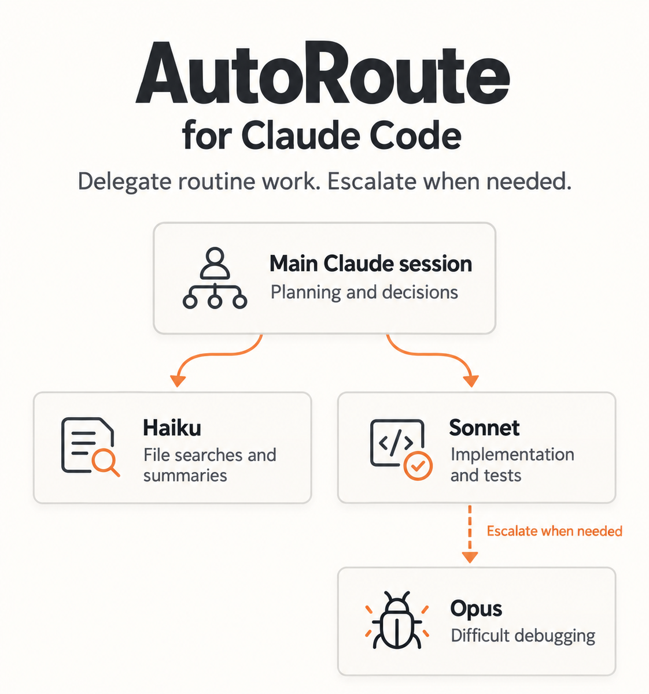

# AutoRoute for Claude Code

<p align="center"></p>

AutoRoute is Claude Code model routing built on Claude Code subagents, spreading work across Haiku, Sonnet, and Opus with failure tracking and experimental self-tuning.

Running everything on the top model means it also does your file searches, log reads and boilerplate; hand-written routing rules go stale, and nothing tells you when a cheap model was quietly wrong. AutoRoute lets cheaper models handle routine work, and escalates when they struggle.

## What it does

- **Routes by tier.** The session reads which model it is and hands work down: Haiku finds and reads, Sonnet implements, tests and reviews, Opus does UI, the top model only decides.
- **Escalates one rung at a time.** An agent that cannot deliver returns a fixed `ESCALATE` block naming the next rung. Nothing jumps straight to the top model.
- **Records failures.** Every agent logs a ledger row, and the caller logs a `WRONG` row when a delegated answer proves wrong.
- **Tunes itself, and reverts.** A `retune` agent moves tiers one rung at a time from those ledgers, then verifies its own last move against its baseline.

AutoRoute records task outcomes and can adjust model choices over time. Its experimental tuning process can reverse changes that do not improve results.

## Quick install

```bash
git clone https://github.com/Bijaykars/claude-code-autoroute
cd claude-code-autoroute
python install.py            # Python 3.9+ on PATH
```

Restart Claude Code.
`python install.py --dry-run` previews the changes; `--uninstall` removes them.

By default this installs only the routing block, agents and hooks; your existing `CLAUDE.md` and coding preferences are kept. `--full-claude-md` also installs the coding rules. Details, manual steps and what gets backed up: [docs/install.md](docs/install.md).
Optional companion: the [Ponytail](https://github.com/DietrichGebert/ponytail) plugin for a minimal-code discipline; AutoRoute does not require it.

**Experimental: as a plugin**, without touching your `CLAUDE.md`:
`/plugin marketplace add Bijaykars/claude-code-autoroute` then `/plugin install autoroute`. Newer and less exercised than `install.py`; see [docs/plugin.md](docs/plugin.md).

## How it routes

| you are | do yourself | hand off |
|---|---|---|
| Fable / Opus | decide, plan, judge, verdicts, ambiguous or risky edits | all searching, all long reads, boilerplate, well-specified edits, tests, review |
| Sonnet | the above plus well-specified implementation | searching, long reads, boilerplate |
| Haiku | find and read only | never writes code |

Small, self-contained tasks with complete context stay in the main session; starting an agent has overhead.

| shape | route |
|---|---|
| one small change with complete context | finish in the current session |
| file discovery or factual extraction | `locate` / `digest` |
| clearly specified implementation | `implement` / `scaffold` |
| ambiguous design or hard debugging | opus (via `model: opus`) |

See [docs/escalation.md](docs/escalation.md) for the escalation contract and [docs/self-tuning.md](docs/self-tuning.md) for the ledger, thresholds and rollback.
Common questions: [docs/faq.md](docs/faq.md).

### Commands

`python autoroute.py <command>` (or `/autoroute <command>` under the plugin) reads `.claude/autoroute/ledger.jsonl`, the hook-captured ledger:
`status` — per-agent runs/escalated/wrong and RETUNE DUE flags · `stats` — agent x model table of runs, success %, tokens, duration · `why <agent> [words...]` — per-model record, "insufficient data" below N=10, never a recommendation below it · `wrong <agent_id|last> "<why>"` — mark a delegated result wrong · `off` / `on` — the global kill switch · `mark-retune <agent> "<note>"` — the marker `retune` writes instead of a markdown line. Details: [docs/plugin.md](docs/plugin.md).

## Cost

### Cost, in theory

List prices per million tokens from the Claude API docs (2026-09-14): Fable 5.1 $10 in / $50 out, Opus 5 $5 / $25, Sonnet 5 $2 / $10, Haiku 4.5 $1 / $5. At an 80/20 input/output mix that is a blended $18 / $9 / $3.60 / $1.80 per million, so Opus is half of Fable, Sonnet a fifth, Haiku a tenth.

The saving depends entirely on how much of a session is lookup and mechanical work versus judgment. An illustrative split for a typical coding session, 1M delegated tokens:

| share of tokens | kind of work | runs on | blended $/M | cost |
|---|---|---|---|---|
| 30% | searching, reading logs and docs | Haiku | 1.80 | $0.54 |
| 50% | specified edits, tests, review, scripts | Sonnet | 3.60 | $1.80 |
| 15% | UI and design | Opus | 9.00 | $1.35 |
| 5% | judgment, verdicts | Fable | 18.00 | $0.90 |
| **100%** | | **routed** | | **$4.59** |
| 100% | everything on the top model | Fable | 18.00 | $18.00 |

Under that split the delegated work costs about a quarter of the all-top-model price. Move the split toward judgment and the saving shrinks; move it toward lookups and it grows. Measure your own split from the ledgers before quoting a number, and remember the orchestrating session itself still runs on the top model. Subscription usage is a different accounting from API cost; keep them separate.

### Estimated API cost from reported token usage, one working day

One session on the author's own project (a Node/Express trading-signals codebase with a vanilla-JS frontend), 2026-09-14, using the token counts each subagent reported on completion. Twenty-two delegated tasks: repo searches, log digests, a root-cause bug fix, a new UI tab, a code review, two research batteries, a theme pass, a web research task. The dollar figures assume an 80/20 input/output split because the reported counts were totals, not separate input/output/cache numbers; real input/output/cache accounting is on the roadmap.

| tier | tokens | blended $/M (80% in, 20% out) | cost |
|---|---|---|---|
| Haiku 4.5 (locate, digest) | 462k | 1.80 | $0.83 |
| Sonnet 5 (implement, review, debug, research scripts) | 1,725k | 3.60 | $6.21 |
| Opus 5 (UI work) | 275k | 9.00 | $2.48 |
| Fable 5.1 (web research, docs lookup) | 211k | 18.00 | $3.80 |
| **routed total** | **2,673k** | | **$13.32** |
| same tokens, all on Fable 5.1 | 2,673k | 18.00 | $48.12 |

The delegated work cost 28% of what the same tokens would have cost on the top model. The split that day was 17% Haiku, 65% Sonnet, 10% Opus, 8% Fable by tokens, so it was heavier on Sonnet than the illustrative split above and lighter on lookups.

What it excludes: the orchestrating session's own tokens (the part the top model was actually paid for), prompt-cache discounts, retries, and the possibility that a stronger model would have finished some tasks in fewer tokens. One day, one project, one operator. It is the order of magnitude, not a benchmark; the reproducible comparison is on the roadmap.

## What is inside

| path | what it is |
|---|---|
| `CLAUDE.md` | Global rules: cost routing, token discipline, think-before-coding, the ladder, surgical changes, goal-driven execution |
| `agents/locate.md`, `agents/digest.md` | Haiku. Find and read only. |
| `agents/scaffold.md`, `agents/implement.md`, `agents/test-writer.md`, `agents/reviewer.md` | Sonnet. Mechanical edits, implementation, tests, review. |
| `agents/deep-debug.md` | Sonnet first; escalates itself to Opus after a reproduction attempt. |
| `agents/retune.md` | Re-tiers agents from their ledgers, then verifies or reverts its own last move. |
| `hooks/retune-due.py` | SessionStart. Flags when an agent has enough ledger rows to retune. |
| `hooks/prompt-nudge.py` | UserPromptSubmit. Re-asserts the routing rule each turn. |
| `hooks/inline-counter.py` | PostToolUse. Nudges after N consecutive inline tool calls without delegating. |
| `hooks/ledger.py` | PreToolUse(Agent)/SubagentStart/SubagentStop. Writes the hook-captured ledger. |
| `autoroute.py` | CLI: `status`, `stats`, `why`, `wrong`, `off`/`on`, `mark-retune`. |
| `.claude-plugin/`, `commands/autoroute.md` | Plugin packaging (experimental): `plugin.json`, `marketplace.json`, the `/autoroute` slash command. |
| `settings.example.json` | The hook wiring for a non-plugin install. |
| `install.py` | Installer and uninstaller. `--dry-run`, `--uninstall`, `--full-claude-md`. |
| `tests/test_hooks.py` | Subprocess tests for the hooks and the CLI. |
| `docs/` | Install steps, the plugin path, the escalation contract, the self-tuning loop. |

## Status

- Running on one project since 2026-09-14; the ledgers have a handful of rows, and one working day has been measured — neither is a benchmark.
- The retune thresholds are starting heuristics, and the file that defines them says so.
- Agents only write their ledger row if the instruction is explicit and includes the path.

## Roadmap

Done in 0.3: plugin packaging (`docs/plugin.md`, experimental), the hook-captured ledger (`hooks/ledger.py`), and `python autoroute.py status | stats | why | wrong | off | on | mark-retune`.

- A small reproducible comparison ("benchmark"): ordinary Claude Code, fixed model assignments, routing with retuning. Task success, total cost including the main session and delegation overhead, elapsed time, retries.
- Automatic redo: when `autoroute.py wrong` marks a run wrong, re-dispatch the same task to the next rung automatically instead of requiring the caller to do it by hand.
- `/autoroute rollback` — revert a retune move immediately, without waiting for the next session's verify-or-revert cycle.
- Cost-to-success routing: once every model cell for an agent reaches N ≥ 10, route new delegations to the cheapest expected-cost-to-success tier automatically instead of only reporting it via `why`.

## Credits

The "think before coding / simplicity first / surgical changes / goal-driven execution" sections of the full `CLAUDE.md` adapt [multica-ai/andrej-karpathy-skills](https://github.com/multica-ai/andrej-karpathy-skills) (a community distillation, not affiliated with Andrej Karpathy). The ladder paraphrases [DietrichGebert/ponytail](https://github.com/DietrichGebert/ponytail).
The routing, escalation contract, ledgers, retune loop and hooks are this repo's own.

## License

MIT.
